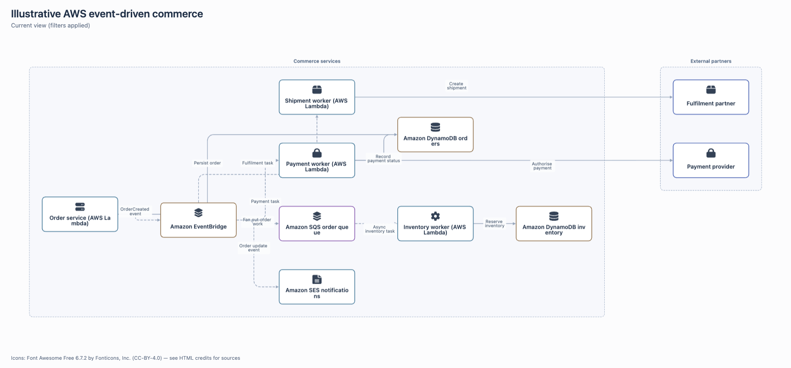
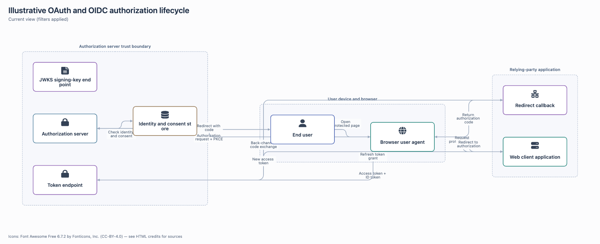
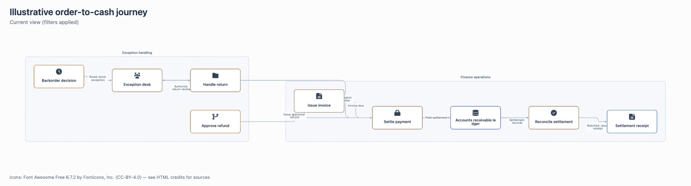
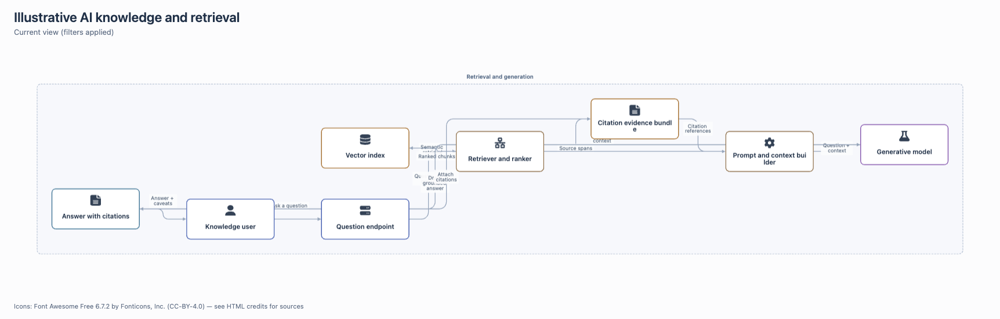
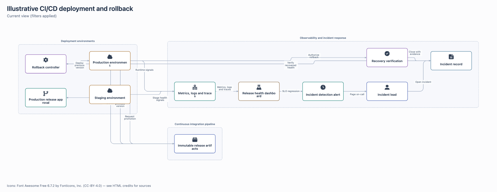

# Topoform

Topoform turns a small, editable JSON diagram model into a polished,
self-contained interactive HTML artifact. Build architecture maps, workflows,
data lineage, dependencies, knowledge maps, and state graphs that remain
portable, reviewable, and usable without runtime network access.

The model is the source of truth; the generated HTML is the shareable artifact.
Validation, integrity checks, offline browser checks, accessible controls, and
PNG export are part of the workflow—not promises to implement later.

## Showcase gallery

Each graph-only preview links to its editable JSON model:

<table>
  <tr><th>Event-driven AWS commerce</th></tr>
  <tr><td align="center"><a href="examples/aws-commerce.json"></a></td></tr>
  <tr><th>OAuth/OIDC authentication</th></tr>
  <tr><td align="center"><a href="examples/oauth-oidc.json"></a></td></tr>
  <tr><th>Order-to-cash process</th></tr>
  <tr><td align="center"><a href="examples/order-to-cash.json"></a></td></tr>
  <tr><th>AI knowledge and retrieval</th></tr>
  <tr><td align="center"><a href="examples/ai-retrieval.json"></a></td></tr>
  <tr><th>CI/CD deployment and rollback</th></tr>
  <tr><td align="center"><a href="examples/cicd-rollback.json"></a></td></tr>
</table>

The AWS view is illustrative and does not provision or discover infrastructure.

## Install in 30 seconds

Install the root Agent Skill with the standard Skills CLI:

```bash
npx skills add danchurko/topoform --skill topoform
```

Then ask your coding agent to use `topoform` for a diagram while keeping the
JSON source and generated HTML together. To try the bundled example from a
checkout:

```bash
python3 scripts/diagram.py doctor
python3 scripts/diagram.py validate examples/aws-commerce.json
python3 scripts/diagram.py build examples/aws-commerce.json output/aws-commerce.html
```

Open `output/aws-commerce.html` in a JavaScript-capable browser. The artifact
contains its runtime, selected icons, and notices; it does not call a CDN or
another web service. A source/document link is followed only after the user
explicitly activates it.

## Showcase models

The editable showcase models cover five different stories:

- event-driven AWS commerce (illustrative architecture only)
- OAuth/OIDC authentication and token lifecycle
- order-to-cash business process
- AI knowledge and retrieval pipeline
- CI/CD deployment with incident rollback

Open the [example models](examples/) to inspect the authored topology, evidence
state, relationships, and named views. Every gallery image above is a
checked-in, deliberately selected preview; the package does not use
placeholder screenshots.

## What you can model

- nested logical boundaries with one explicit parent per node
- directed, undirected, parallel, cyclic, and self-loop relationships
- people, teams, services, stores, documents, processes, states, and concepts
- evidence states (`observed`, `declared`, `inferred`, and `proposed`)
- named views, edge-kind filters, search, neighbour/upstream/downstream focus,
  and a complete text representation
- safe source links, source JSON download, current-view PNG export, and
  full-model PNG export
- 114 curated local SVG icons from five reviewed packs, with source-namespaced
  identifiers and embedded credits

Topoform is model-first: presentation state such as positions, filters, and
highlights is generated at build or view time and is never written back into
the authored model.

## Workflow

1. Define the question, audience, scope, and evidence state.
2. Author or revise the JSON model and choose meaningful relationships.
3. Run schema and semantic validation, including endpoint, containment, icon,
   link, and integrity checks.
4. Build a self-contained HTML artifact and run the offline browser gate.
5. Inspect desktop, wide, mobile, and exported PNG views for readability.
6. Share the JSON model with the HTML artifact and state what was verified.

`scripts/deliver.py` promotes a browser-checked candidate atomically. A build or
browser failure leaves the last-good artifact unchanged. If receipt writing
fails after promotion, the command reports that the new artifact was already
delivered. A passing browser gate does not replace visual review.

## Package contents

| Path | Purpose |
| --- | --- |
| `SKILL.md` | Agent-facing instructions and boundaries |
| `assets/viewer.html`, `assets/viewer.js` | Self-contained viewer shell and interactions |
| `assets/diagram.schema.json` | Editor-friendly structural model schema |
| `assets/vendor/` | Pinned official npm browser distributions, licenses, and hashes |
| `assets/icons/` | 114 reviewed SVG icons, registry, licenses, and disclaimer |
| `scripts/diagram.py` | Validation, integrity checks, and offline compilation |
| `scripts/deliver.py` | Browser-gated atomic delivery |
| `scripts/browser_check.py` | Offline Chromium behavior and export checks |
| `scripts/acceptance.py` | Complete installed-package acceptance seam |
| `scripts/import_icon.py` | Safe local SVG ingestion with provenance |
| `scripts/vendor_from_npm.py` | Staged official npm runtime refresh |
| `scripts/release.py` | Public package and archive validation |
| `examples/` | Editable diagram models and showcase sources |
| `references/` | Model, composition, icon, quality, and source guidance |
| `evals/` | Agent-level behavioral evaluation prompts |
| `tests/` | Focused model, security, determinism, and release tests |

The semantic validator is authoritative for cross-record invariants that JSON
Schema cannot express, including identity uniqueness, endpoint validity,
containment, and icon membership.

## Tested runtime and icon packs

The browser runtime uses exact, pinned official npm distributions:

| Package | Version | License |
| --- | ---: | --- |
| Cytoscape.js | 3.33.1 | MIT |
| ELK.js | 0.9.3 | EPL-2.0 |
| cytoscape-elk | 2.3.0 | MIT |

The bundled icon catalogue contains:

| Pack | Version | Count | License |
| --- | ---: | ---: | --- |
| Font Awesome Free Solid | 6.7.2 | 21 | CC-BY-4.0 |
| Tabler Icons | 3.35.0 | 24 | MIT |
| Lucide | 0.544.0 | 24 | ISC; Feather-derived portions MIT |
| Material Design Icons | 7.4.47 | 24 | Apache-2.0 |
| Simple Icons | 15.15.0 | 21 | Per-icon terms; collection CC0 |

`assets/vendor/manifest.json` and `assets/icons/manifest.json` record each
file's source, version, license, attribution, modification notes, and SHA-256
digest. Read [THIRD_PARTY_NOTICES.md](THIRD_PARTY_NOTICES.md) before
redistributing the package or its exported icons. Brand marks remain subject to
their owners' trademark and usage guidance; no affiliation or endorsement is
implied.

## Verification

Fast focused checks:

```bash
python3 -m unittest discover -s tests -p test_model.py -v
python3 scripts/release.py check . --tag v1.0.0
```

Browser checks require Playwright and Chromium:

```bash
python3 tests/run_browser.py --out topoform-browser-checks
```

The browser gate blocks runtime network requests and checks ready state,
geometry, authored relationships, interactions, and PNG decoding. It does not
certify visual quality, Safari, Firefox, agent preview sandboxes, or a real
touch device. If a restricted environment requires exact HTML-content loading
instead of direct `file://` navigation, report that limitation explicitly.

## Security and offline behavior

Topoform rejects duplicate JSON keys, non-finite numbers, malformed models,
unknown icons, unsafe URLs, path escapes, and active SVG content before
rendering. Labels and metadata are embedded as text-safe JSON. The generated
page uses local runtime assets and a restrictive CSP; it does not fetch runtime
data, icons, fonts, or scripts.

Filtering, named views, and focus are presentation controls, not access
control. Do not embed secrets or sensitive details in a shareable artifact.
Topoform does not scan a repository for secrets.

## Limitations

Topoform is not a graphical editor, infrastructure provisioner, live discovery
or monitoring system, authenticated dashboard, or specialist BPMN/UML/sequence
grammar. It does not provide freehand positioning, exact port routing, native
SVG export, built-in collapse/expand, or live impact analysis. ELK supplies
layered node placement through `cytoscape-elk`; this viewer renders edges with
Cytoscape and does not apply ELK edge sections or ports. Dense models may need
focused views, a text representation, or separate artifacts to remain readable.

## Contributing

Keep authored JSON separate from generated HTML. For model or viewer changes,
run the focused unit suite, integrity checks, a real browser run, and visual
inspection of the affected views. Add or update a source, license, attribution,
and digest whenever an icon or runtime asset changes. Keep showcase claims
illustrative or evidence-backed, and do not commit generated test evidence.

Read [SKILL.md](SKILL.md), [references/model.md](references/model.md),
[references/composition.md](references/composition.md), and
[references/quality-and-limits.md](references/quality-and-limits.md) before a
substantive change.

## License

Original Topoform code and documentation are MIT-licensed; see
[LICENSE](LICENSE). Cytoscape.js, ELK.js, cytoscape-elk, and each icon pack
retain their own licenses and notices; see
[THIRD_PARTY_NOTICES.md](THIRD_PARTY_NOTICES.md) and the files under
`assets/vendor/` and `assets/icons/`.
